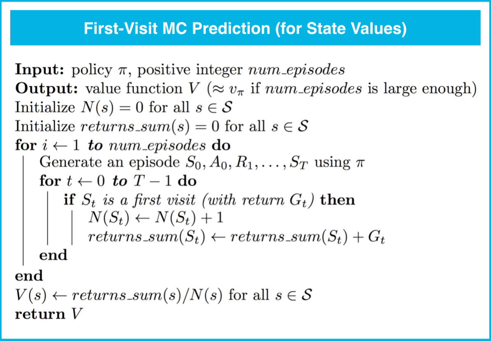
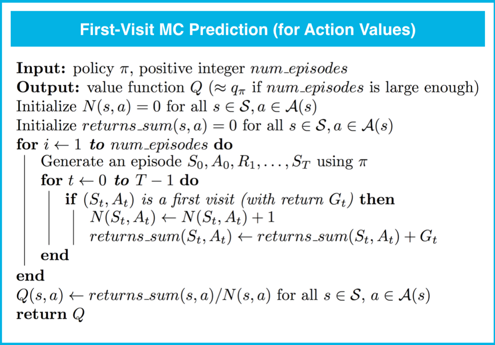
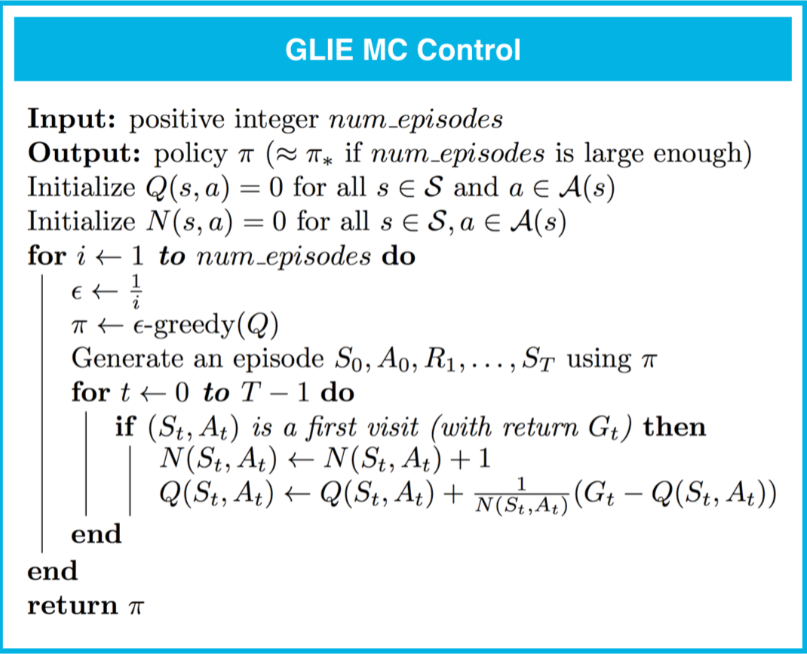
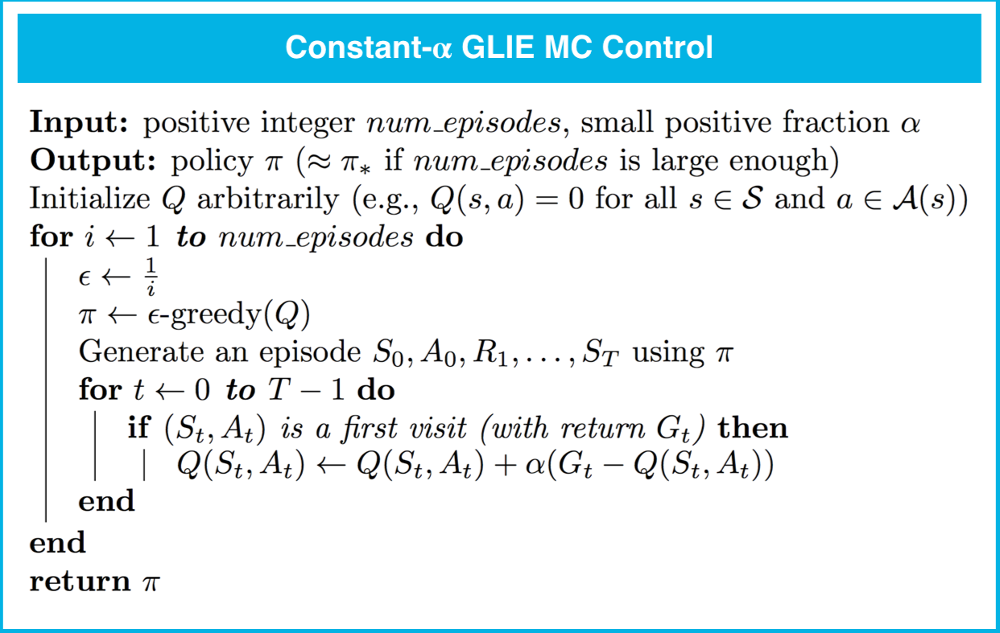

# MC 预测（状态值)

- 解决**预测问题**的算法会确定策略 π 对应的值函数 $v_\pi$（或 $q_\pi$）。
- 通过与环境互动评估策略π的方法分为两大类别：
  - **异同策略**方法使智能体与环境互动时遵守的策略 π 与要评估（或改进）的策略相同。
  - **离线策略**方法使智能体与环境互动时遵守的策略 b（其中 b≠π）与要评估（或改进）的策略不同。
- 状态 s∈S 在某个阶段中的每次出现称为 **s 的一次经历**。
- 有两种类型的蒙特卡洛 (MC) 预测方法（用于估算$v_\pi$）：
  - **首次经历 MC** 将 $v_\pi(s)$ 估算为仅在 s 首次经历之后的平均回报（即忽略与后续经历相关的回报）。
  - **所有经历 MC** 将 $v_\pi(s)$ 估算为 s 所有经历之后的平均回报。




```python
from collections import defaultdict
import numpy as np
import sys

def mc_prediction_v(env, num_episodes, generate_episode, gamma=1.0):
    # initialize empty dictionary of lists
    returns = defaultdict(list)
    # loop over episodes
    for i_episode in range(1, num_episodes+1):
        # monitor progress
        if i_episode % 1000 == 0:
            print("\rEpisode {}/{}.".format(i_episode, num_episodes), end="")
            sys.stdout.flush()
        
        ## TODO: complete the function
        episode = generate_episode(env)
        states, actions, rewards = zip(*episode)
        discounts = np.array([gamma**i for i in range(len(rewards)+1)])
        for i, state in enumerate(states):
            returns[state].append(sum(rewards[i:]*discounts[:-(1+i)]))
            
    V = {k: np.mean(v) for k, v in returns.items()}
    return V
```


## MC 预测：动作值

- 状态动作对 $s,a (s∈S,a∈A) $在某个阶段中的每次出现称为 **s,a 的一次经历**。
- 有两种类型的蒙特卡洛 (MC) 预测方法（用于估算$q_\pi$）：
  - **首次经历 MC** 将 $q_\pi(s,a)$ 估算为仅在 s,a 首次经历之后的平均回报（即忽略与后续经历相关的回报）。
  - **所有经历 MC** 将 $q_\pi(s,a)$ 估算为 s,a 所有经历之后的平均回报。



```python
def mc_prediction_q(env, num_episodes, generate_episode, gamma=1.0):
    # initialize empty dictionaries of arrays
    returns_sum = defaultdict(lambda: np.zeros(env.action_space.n))
    N = defaultdict(lambda: np.zeros(env.action_space.n))
    Q = defaultdict(lambda: np.zeros(env.action_space.n))
    # loop over episodes
    for i_episode in range(1, num_episodes+1):
        # monitor progress
        if i_episode % 1000 == 0:
            print("\rEpisode {}/{}.".format(i_episode, num_episodes), end="")
            sys.stdout.flush()
        
        ## TODO: complete the function
        episode = generate_episode(env)
        states, actions, rewards = zip(*episode)
        discounts = np.array([gamma**i for i in range(len(rewards)+1)])
        
        for i, state in enumerate(states):
            returns_sum[state][actions[i]] += sum(rewards[i:]*discounts[:-(1+i)])
            N[state][actions[i]] += 1.0
            Q[state][actions[i]] = returns_sum[state][actions[i]] / N[state][actions[i]]
    return Q
```


## 广义策略迭代

- 旨在解决**控制问题**的算法会通过与环境互动确定最优策略 $\pi_*$。
- **广义策略迭代 (GPI)** 是指通过交替地进行策略评估和和改进步骤搜索最优策略的广义方法。我们在这门课程中讲解的所有强化学习方法都可以归类为 GPI。

## MC 控制：增量均值

- （在此部分，我们推出了一个算法，该算法可以不断得出一系列数字的平均值。）

## MC 控制：策略评估

- （在此部分，我们修改了策略评估步骤，在每个互动阶段结束后更新值函数。）

## MC 控制：策略改进

- 如果对于每个状态s∈S，它保证会选择满足 $a = \arg\max_{a\in\mathcal{A}(s)}Q(s,a)$ 的动作 $a\in\mathcal{A}(s)$，则策略相对于动作值函数估值 Q 来说是贪婪策略。（通常将所选动作称之为**贪婪动作**。）
- 如果对于每个状态$s∈S$，策略相对于动作值函数估值Q是$ϵ $贪婪策略。
  - 概率为 $1-\epsilon$ 时，智能体选择贪婪动作，以及
  - 概率为 $\epsilon$ 时，智能体随机（均匀地）选择一个动作。

## 探索与利用

- 所有强化学习智能体都面临**探索-利用困境**，即智能体必须在根据当前信息采取最优动作（**利用**）和需要获取信息以做出更好的判断（**探索**）之间找到平衡。
- 为了使 MC 控制收敛于最优策略，必须满足有限状态下的无限探索贪婪算法 (GLIE)条件：
  - 所有状态动作对 s, a（对于所有 s∈S和 a∈A(s)）被经历无穷次，以及
  - 策略收敛于相对于动作值函数估值 Q 来说是贪婪策略的策略。




```python
def get_probs(Q_s, epsilon, nA):
    """ obtains the action probabilities corresponding to epsilon-greedy policy """
    policy_s = np.ones(nA) * epsilon / nA
    best_a = np.argmax(Q_s)
    policy_s[best_a] = 1 - epsilon + (epsilon / nA)
    return policy_s

def generate_episode_from_Q(env, Q, epsilon, nA):
    """ generates an episode from following the epsilon-greedy policy """
    episode = []
    state = env.reset()
    while True:
        action = np.random.choice(np.arange(nA), p=get_probs(Q[state], epsilon, nA)) \
                                    if state in Q else env.action_space.sample()
        next_state, reward, done, info = env.step(action)
        episode.append((state, action, reward))
        state = next_state
        if done:
            break
    return episode

def update_Q_GLIE(env, episode, Q, N, gamma):
    """ updates the action-value function estimate using the most recent episode """
    states, actions, rewards = zip(*episode)
    # prepare for discounting
    discounts = np.array([gamma**i for i in range(len(rewards)+1)])
    for i, state in enumerate(states):
        old_Q = Q[state][actions[i]] 
        old_N = N[state][actions[i]]
        Q[state][actions[i]] = old_Q + (sum(rewards[i:]*discounts[:-(1+i)]) - old_Q)/(old_N+1)
        N[state][actions[i]] += 1    
    return Q, N

def mc_control_GLIE(env, num_episodes, gamma=1.0):
    nA = env.action_space.n
    # initialize empty dictionaries of arrays
    Q = defaultdict(lambda: np.zeros(nA))
    N = defaultdict(lambda: np.zeros(nA))
    # loop over episodes
    for i_episode in range(1, num_episodes+1):
        # monitor progress
        if i_episode % 1000 == 0:
            print("\rEpisode {}/{}.".format(i_episode, num_episodes), end="")
            sys.stdout.flush()
        
        ## TODO: complete the function
        epsilon = 1.0/((i_episode/8000)+1)
        # generate an episode by following epsilon-greedy policy
        episode = generate_episode_from_Q(env, Q, epsilon, nA)
        # update the action-value function estimate using the episode
        Q, N = update_Q_GLIE(env, episode, Q, N, gamma)
    # determine the policy corresponding to the final action-value function estimate
    policy = dict((k,np.argmax(v)) for k, v in Q.items())
    return policy, Q
```


## MC 控制：常量 α

- 步长参数 $\alpha$ 必须满足 $0 < \alpha ≤1$。$\alpha$ 值越大，学习速度越快，但是如果 α 的值过大，可能会导致 MC 控制无法收敛于 $\pi_∗$。




```python
def update_Q_alpha(env, episode, Q, alpha, gamma):
    """ updates the action-value function estimate using the most recent episode """
    states, actions, rewards = zip(*episode)
    # prepare for discounting
    discounts = np.array([gamma**i for i in range(len(rewards)+1)])
    for i, state in enumerate(states):
        old_Q = Q[state][actions[i]] 
        Q[state][actions[i]] = old_Q + alpha*(sum(rewards[i:]*discounts[:-(1+i)]) - old_Q)
    return Q

def mc_control_alpha(env, num_episodes, alpha, gamma=1.0):
    nA = env.action_space.n
    # initialize empty dictionary of arrays
    Q = defaultdict(lambda: np.zeros(nA))
    # loop over episodes
    for i_episode in range(1, num_episodes+1):
        # monitor progress
        if i_episode % 1000 == 0:
            print("\rEpisode {}/{}.".format(i_episode, num_episodes), end="")
            sys.stdout.flush()
        
        ## TODO: complete the function
        epsilon = 1.0/((i_episode/8000)+1)
        # generate an episode by following epsilon-greedy policy
        episode = generate_episode_from_Q(env, Q, epsilon, nA)
        # update the action-value function estimate using the episode
        Q = update_Q_alpha(env, episode, Q, alpha, gamma)
    # determine the policy corresponding to the final action-value function estimate
    policy = dict((k,np.argmax(v)) for k, v in Q.items())
    return policy, Q
```

